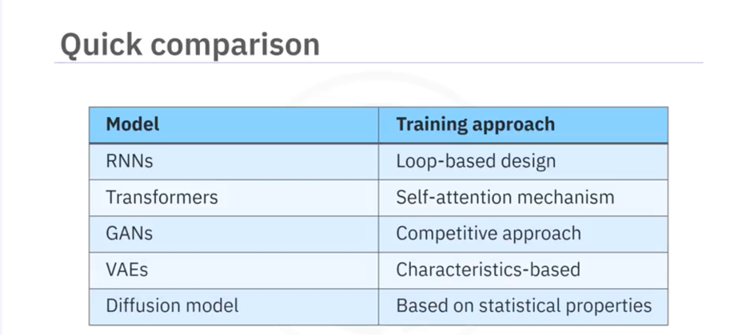

### Generative AI Architecture and Models

- RNN's : recurrent neural network
    - RNNs are artificial neural networks that use sequential or time series data.
    - You use them to solve data related problems with a natural order or timebased dependencies.
    - RNNs differ from regular neural networks due to loops
      built into their structure.
    - This loop-based design enables RNNs to remember previous inputs and influence the
      current input and output.
    - This design is crucial for tasks that deal with sequences such as language modeling.
    - In RNN fine-tuning, adjustments to the weights and structure of the recurrent neural network might be necessary to
      align it with specific tasks or datasets.
    - You can use RNNs in natural language processing or NLP language translation, speech recognition, and image
      captioning.
- Transformers
    - Transformers are deep learning models that can translate text and speech in near real time.
    - They take data such as words or numbers, and pass it through different layers.
    - Information flows in one direction, starting at the input layer, going through hidden layers, and reaching the
      output layer.
    - The transformer employs feedback mechanisms to improve accuracy.
    - Transformers are designed with a self attention mechanism that enables the model to focus on the most important
      parts of the information it's looking at, making its understanding and decision-making more efficient.
    - The selective focus on different parts of the input sequence allows the model to concentrate on specific segments
      concurrently, enabling parallelization for efficient training.
    - In transformer fine-tuning, the pretrained transformer model remains largely intact, and fine-tuning typically
      involves training only the final output layers for the specific task.
    - The transformer's self attention mechanisms and other layers usually remain fixed.
    - A generative pretrained transformer or GPT is an example of a generative model that demonstrates exceptional text
      generation capabilities within the transformer architecture.
    - GPT is a generative model trained to predict and generate text sequences based on the patterns learned from its
      training data.
    - Even though it doesn't explicitly model the underlying data distribution Like some generative
      models, its capacity to produce text that mirrors its training data distribution and its versatility in
      fine-tuning confirms its role as a generative model.
- GAN's : generative adversarial networks
    - GAN is a generative AI model consisting of two submodels, a generator and a discriminator.
    - The generator creates fake samples and sends them to the discriminator.
    - The discriminator checks their authenticity by comparing them with real samples from a domain set.
    - It then assigns a probability score to each sample, indicating how likely the sample is to be authentic.
    - This adversarial process continues like a friendly competition, with the generator striving to make things look
      real and the discriminator learning to distinguish between real and fake, both
      entities improving their respective outputs.
    - You'll find GAN specifically useful for image and video generation.
- VAE : variational autoencoders
    - VAE, operates on an encoder decoder framework.
    - The encoder network first compresses input data into a simplified abstract space that captures essential
      characteristics.
    - The decoder network then uses this condensed information to recreate the original data.
    - VAEs focus on learning the underlying patterns within the input data, making it possible to create new data
      samples
      that share similar characteristics.
    - VAEs represent data using probability distributions in the latent space.
    - They can produce a range of possible outputs for a given input, reflecting the inherent uncertainty in real world
      data.
    - You'll find them useful in applications related to art and creative design.
- Diffusion Models
    - the diffusion model, a probabilistic generative model.
    - A diffusion model is trained to generate images by learning how to remove noise or reconstruct examples from its
      training data that have been distorted beyond recognition.
    - Depending on the prompt, a diffusion model can generate highly creative images based on the statistical properties
      of its training data.
    - You can use a diffusion model to generate high quality images from noisy or low quality inputs, like restoring an
      old, distorted photograph.
    - In summary, the training approaches differ among the architectures and models. RNNs use a loop based design,
      transformers utilize a self attention mechanism, GANs employ a competitive training approach, VAEs adopt a
      characteristics based approach, and diffusion models depend on statistical properties. Generative AI models are
      closely tied to reinforcement learning.
    - Traditional reinforcement learning focuses on how agents like AI systems or robots interact with their environment
      to maximize rewards.

- Quick Comparision
    - 
- Summary
    - Generative AI models employ reinforcement learning techniques during training to fine tune and optimize their
      performance for specific tasks.
    - Generative AI architectures and models include RNNs, transformers, GANs, VAEs, and diffusion models.
    - RNNs use sequential or time series data and a loop based design for training.
    - Transformers utilize the self-attention mechanism to focus on the most important parts of the information.
    - GANs consist of a generator and a discriminator, which work in a competitive mode.
    - VAEs operate on an encoder decoder framework and create samples based on similar characteristics.
    - Diffusion models generate creative images by learning to remove noise and reconstruct distorted examples, relying
      on statistical
      properties.

### Generative AI for NLP

- Generative AI architectures enable machines to comprehend human language and generate responses, you cannot
  distinguish from what a human generates.
- They improve language processing by incorporating context awareness, and ensuring coherent interactions.
- They enable meaningful conversations through predictive analytics and advanced modeling.
- The NLP systems based on generative AI architectures sense the feelings and grasp the intentions behind words,
  extending their understanding
  beyond mere words.
- Generic linguistic rules to ML based predictions to DL neural networks
- Transformers have a greater ability to understand context and dependencies within language than their predecessors.
  Generative AI for NLP is constantly evolving due to consistent efforts, to improve how machines understand and
  generate language.
- You'll notice this evolution in the significant advancements in machine translation, chatbot conversation, sentiment
  analysis, and text summarization.
- Large language models, or LLMs, are foundation models that use AI and deep learning with vast datasets such, as
  websites and books to generate text, translate languages, and create various types of content.
- They are referred to as large language models due to the size of the training data set, which may reach petabytes.
- Bi-directional encoder representation from transformers or BERT, Bi-directional and autoregressive transformers or
  BERT and text to text transfer transformer, also called T5.
- GPT primarily acts as a decoder adept at generating text. It excels in tasks where creating coherent and contextually
  relevant content is crucial for example, chatbots. BERT
  utilizes an encoder only transformer architecture.
- It is exceptional at understanding the context of a word within a sentence, which is crucial for nuanced tasks like
  sentiment analysis, and question answering. Models such as BERT and
  T5 follow an encoder decoder architecture.
- They leverage encoding for contextual understanding and decoding to generate texts.
- This versatility makes them well suited for various NLP tasks.
- The term GPT and ChatGPT might sound interchangeable, though these models share similarities, GPT focuses on diverse
  text generation tasks, whereas ChatGPT focuses on
  generating conversations.
- For training and fine tuning GPT predominantly uses supervised learning, it might use reinforcement learning, but with
  less focus on conversational aspects.
- ChatGPT uses a combination of supervised learning and reinforcement learning.
- GPT does not incorporate feedback from human interactions as part of its learning process, whereas Chat GPT uses a
  methodology called reinforcement learning from human feedback, or RLHF, which uses
  human feedback to create a reward model. Most of the LLMs are based on the transformer architecture.
- The versatility of LLMs makes them a key contributor to advancements in natural language understanding and generation.

- Summary
    - Generative AI started with rule based systems that follow predefined linguistic rules.
    - Then machine learning approaches emerged, focusing on statistical methods.
    - A significant leap happened with deep learning, which uses neural networks trained on extensive datasets.
    - Transformers represent the latest in this evolution. The enhanced
      capabilities of generative AI architectures have led to significant advancements in machine translation, chatbot
      conversation, sentiment analysis, and text summarization.
    - LLMs are foundation models that use AI in deep learning with vast data sets. They're called large language models
      due to the size of the training data set, which may run into petabytes.

### Basics of AI Hallucinations

* AI hallucinations refer to an AI model generating output presented as accurate but seen as unrealistic, inaccurate,
  irrelevant, or nonsensical by humans.
* AI hallucination can result in the generation of inaccurate information, the creation of biased views, and wrong input
  provided to sensitive applications.
* You can prevent the problems caused by AI hallucinations through:
    - Extensive training with high-quality data,
    - Avoiding manipulation,
    - Ongoing evaluation and improvement of the models,
    - Fine-tuning on domain-specific data,
    - Being vigilant,
    - Ensuring human oversight, and
    - Providing additional context in the prompt.

### Overview of Libraries and Tools

Summary

- There are various libraries and tools that you can use to develop NLP applications using generative AI. Some tools are
  PyTorch, TensorFlow, Hugging Face, LangChain, and Pydantic.
- PyTorch is an open source deep learning framework. It is a Python-based library well-known for its ease of use,
  flexibility, and dynamic computation graphs.
- TensorFlow is an open-source framework for machine learning and deep learning. It provides tools and libraries to
  facilitate the development and deployment of machine learning models.
- The tight integration of TensorFlow with Keras provides a user-friendly high-level neural networks API, facilitating
  rapid prototyping and building and training deep learning models.
- Hugging Face is a platform that offers an open-source library with pretrained models and tools to streamline the
  process of training and fine-tuning generative AI models. It offers libraries such as Transformers, Datasets, and
  Tokenizers.
- LangChain is an open-source framework that helps streamline AI application development using LLMs. It provides tools
  for designing effective prompts.
- Pydantic is a Python library that helps you streamline data handling. It ensures the accuracy of data types and
  formats before an application processes them.